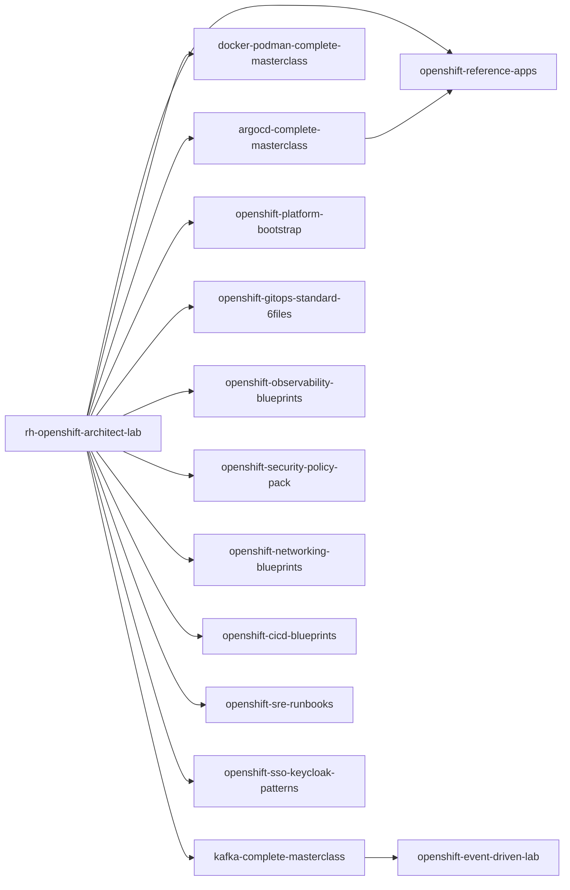

# Cartographie (écosystème)

Interprétation :
- `rh-openshift-architect-lab` = **pédagogie & certification**
- `*-masterclass` = **apprentissage profond**
- `openshift-*-blueprints` / `*-standard-*` = **assets réutilisables en mission**
- `openshift-reference-apps` = **démos GitOps multi-env**
